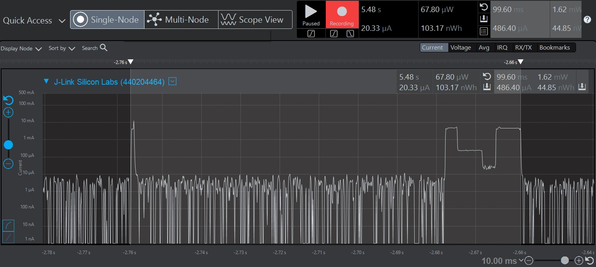

Please include your answers to the questions below with your submission, entering into the space below each question
See [Mastering Markdown](https://guides.github.com/features/mastering-markdown/) for github markdown formatting if desired.

*Be sure to take measurements with logging disabled to ensure your logging logic is not impacting current/time measurements.*

*Please include screenshots of the profiler window detailing each current measurement captured.  See the file Instructions to add screenshots in assignment.docx in the ECEN 5823 Student Public Folder.* 

1. What is the average current per period?
   Answer: 15.87 uA
    Screenshot:  
     

2. What is the average current when the Si7021 is Powered Off?
   Answer: 2.32 uA
    Screenshot:  
     

3. What is the average current when the Si7021 is Powered On?
   Answer: 486.40 uA
    Screenshot:  
     

4. How long is the Si7021 Powered On for 1 temperature reading?
   Answer: 99.60ms
    Screenshot:  
     

5. Compute what the total operating time of your design for assignment 4 would be in hours, assuming a 1000mAh battery power supply?
   Answer: Total current Consumption by my design = 15.87 uA every 3 seconds
		   Total current consumption in an hour = 15.87 *20 *60 = 19.044 mA
		   Total operating time = 1000 mAh/19.044 mA = 52.50 hrs. 
		   So, the total operating time of my design is 52.50 hrs. 
   
6. How has the power consumption performance of your design changed since the previous assignment?
   Answer: In the previous assignment, the average current in one period was 147 uA. This dropped to 15.87uA in this assignment implementation using non-blocking interrupt for Timer and I2C. This is because the controller sleeps in EM3 while it is waiting for power on and i2c write complete. Also, the i2c transaction happens in EM1 Mode. 
   The current consumption when the si7021 was on also dropped from 4.57 mA to 486 uA reducing the overall power consumption by 10 times. 
   
7. Describe how you tested your code for EM1 during I2C transfers.
   Answer: Initially, I kept the I2C transfer in EM3 itself without forcing the CPU to EM1. When I ran the Energy Profiler, I could see no changes in the current waveform with current close to 700 uA. Also, at the terminal, I recieved an I2C transfer Error Message with a negative transferStatus of -3. 
   After that, I made sure that the CPU is in EM1 for the I2C transfer by placing the add and remove requirements for EM1. And it was working fine. This confirms that the I2C transfer doesn't work in EM3 mode. '
   The I2C transfers were also confirmed to be in EM1 by placing breakpoints and checking on the IDE that it is in EM1 Mode for the duration of the I2C Transfer. 

